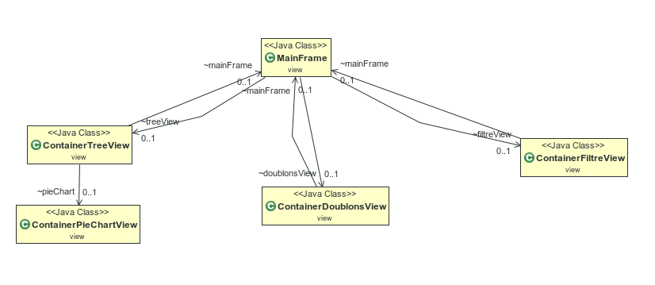
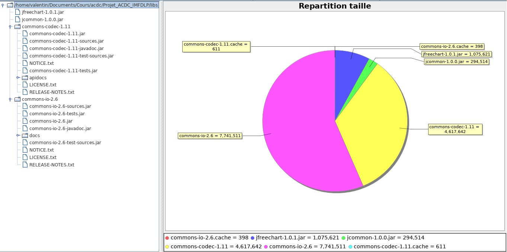
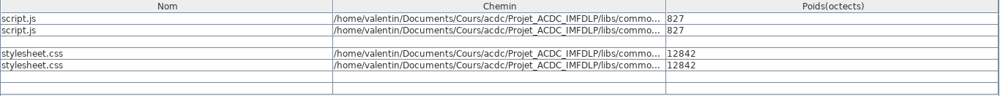
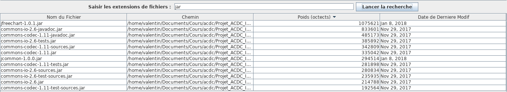
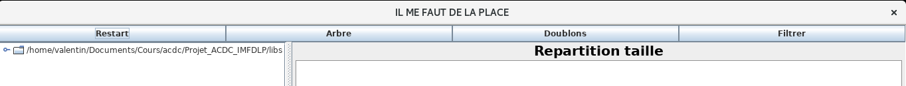
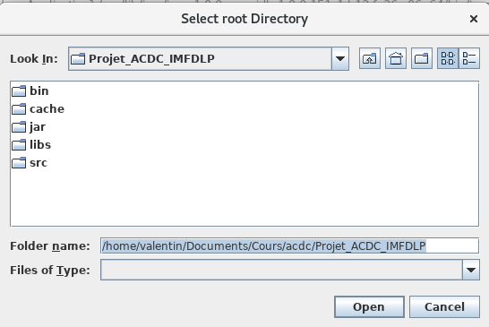

# Compte Rendu Front end

## Architecture
J'ai réalisé une classe [MainFrame](./javadoc/view/MainFrame.html) qui se charge de l'affichage. Comme on le voit sur le diagramme ci-dessus, elle agrège trois [Containers](https://docs.oracle.com/javase/7/docs/api/java/awt/Container.html) portant chacun un onglet de visualisation. C'est elle qui gère la vue active et change de visualisation au grès de l'utilisateur.

## Les visualisations possibles

### La vue arbre

Cette vue est formée à partir d'un [JSplitePane](https://docs.oracle.com/javase/7/docs/api/javax/swing/JSplitPane.html). Sur la gauche, l'arborescence est représentée à l'aide d'un [JTree](https://docs.oracle.com/javase/7/docs/api/javax/swing/JTree.html)
Sur la vue de droite, un [PieChart](https://www.tutorialspoint.com/jfreechart/jfreechart_pie_chart.htm) représente la proportion de l'espace occupé par chaque sous-dossier(s) et fichier(s) contenu(s) par le dossier selectionné dans le JTree.

### La vue doublons

Dans cette vue, au moyen d'une [JTable](https://docs.oracle.com/javase/7/docs/api/javax/swing/JTable.html) sont listés les fichiers présents plusieurs fois dans l'arborescence. Il est possible de selectionner un ou plusieurs fichiers et de les supprimer en appuyant sur la touche **suppr**.

### La vue filtre

Cette vue permet de lister tous les fichiers d'un certain type. Le type de fichier désiré est entré dans le [JTextField](https://docs.oracle.com/javase/7/docs/api/javax/swing/JTextField.html) en haut au milieu de l'écran. Ici on cherche les fichiers jar. Il est possible de chercher plusieurs types de fichiers à la fois.
La table présentant les résultats de la recherche est triable selon des colonnes, et est ici triée par ordre décroissant de la taille des fichiers.
À noter qu'il est également possible de supprimer des fichiers depuis cette vue, comme depuis la vue des doublons.

### La navigation

La navigation s'effectue au moyen de [JButton](https://docs.oracle.com/javase/7/docs/api/javax/swing/JButton.html), chacun activant une vue différente. Le bouton **Restart** permet de changer le point de départ de l'arborescence de fichiers préalablement sélectionnés.

## Quickstart

### Démarrage de l'application
`java -jar IMFLDP_FRONT.jar`

Sélectionnez le point de départ de l'arborescence de fichiers au moyen du [JFileChooser](https://docs.oracle.com/javase/7/docs/api/javax/swing/JFileChooser.html)
puis vous accéderez à l'application

### Import du projet
Importez le projet dans votre IDE préféré, ajoutez le contenu du répertoire libs au buildPath et le projet est setup.

## FeedBack
### Reprise du code
Je n'ai pas rencontré de difficultés majeures. Le code fut facile à reprendre. La documentation était claire d'autant plus que j'ai pu contacter Cedric au moindre doute. Il est intéressant de voir à quel point son code diffère du mien. Au vu de ces différences nous avions une vision radicalement différente du projet mais cela ne m'a pas gêné pour réaliser le front.

### Frontend
J'ai pour habitude de me tenir éloigné du Frontend mais la réalisation de celui-ci ne m'a pas paru pénible. J'ai apprécié manipuler la librairie swing et il est très satisfaisant de voir son interface prendre vie.

### Global
J'ai apprécié le projet dans son ensemble. La partie back fut pour moi l'occasion de mettre en place ma propre structure de données, ma propre architecture. J'ai pris beaucoup de plaisir à faire au maximum les choses moi-même. Nous avions le temps de le faire et je trouve cela plus gratifiant et enrichissant que d'utiliser des librairies. Ainsi en codant nous-même notre solution, on raisonne, on se questionne, et on s'enrichit intellectuellement en apportant notre propre solution au problème posé. Le Frontend fut plus laborieux à réaliser mais loin d'être inintéressant. J'ai préféré, dans cette partie, faire appel à plus de librairies externes que de réaliser moi-même car je porte moins d'interêt à la chose.

Pour conclure, je suis très satisfait d'avoir réalisé ce projet. Il fut enrichissant aussi bien d'un point de vue réalisation, que d'un point de vue échange avec mes camarades ou avec l'enseignant.
